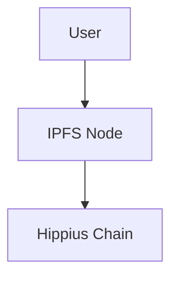

# IPFS Pinning

:::caution Legacy Documentation
This documentation covers IPFS integration, which has been deprecated.

Hippius has transitioned to the Arion storage system for improved performance and reliability.

Why we moved from IPFS to Arion:

<ul style={{ listStyleType: "disc", paddingLeft: "1.25rem" }}>
  <li>Deterministic content placement: "Don't Ask. Compute." Finding data is now a calculation, not a search.</li>
  <li>Eliminates DHT discovery latency (O(log N) -&gt; O(1) lookup).</li>
  <li>Lower latency via computed addressing with the CRUSH algorithm.</li>
  <li>Higher throughput via Grid Streaming (parallel downloads from multiple miners).</li>
  <li>3x better storage efficiency with Reed-Solomon erasure coding (10+20 vs 5x replication).</li>
  <li>66% fault tolerance: can lose 20 out of 30 miners and still recover data.</li>
  <li>Active self-healing with validator "immune system" vs passive pinning.</li>
</ul>

For current storage documentation, see: [Arion Storage Architecture](/learn/arion-storage-architecture).
Learn more: [Hippius Arion: The Next Evolution of Decentralized Storage](https://community.hippius.com/t/hippius-arion-the-next-evolution-of-decentralized-storage/45)
:::

Pin files on Hippius to ensure persistence.

